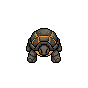
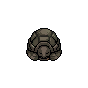
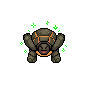

<p align="center">
  
</p>

<h1 align="center">Rocky</h1>

<p align="center">
  <b>Your AI coding agents, living in the notch.</b><br />
  Watch every Claude Code, Codex, Grok, Cursor, Kimi, and OpenCode session and approve permissions without leaving your flow.
</p>

<p align="center">
  <a href="https://github.com/wescld/rocky-notch/actions/workflows/ci.yml"></a>
  <a href="https://github.com/wescld/rocky-notch/releases/latest"></a>
  
  
  <a href="LICENSE">
</p>

<p align="center">
  &nbsp;&nbsp;
  &nbsp;&nbsp;
  &nbsp;&nbsp;
  
</p>

---

Rocky is a native macOS app that sits in your MacBook notch (or menu bar) and
monitors every AI coding agent session on your machine. When an agent asks
for permission, Rocky chimes, shows you the command or the diff, and lets you
approve or deny with one click. In any terminal: Terminal.app, VS Code,
Cursor, cmux, even over SSH.

## Why it works everywhere

Rocky integrates through the agents' **official hooks APIs**, not terminal
injection or screen scraping. The approval flow:

```
Claude Code ── PermissionRequest hook ──▶ rocky-hook ── unix socket ──▶ Rocky
Grok        ── PreToolUse hook         ──▶ rocky-hook ── unix socket ──▶ Rocky
Kimi        ── PreToolUse hook (plugin)──▶ rocky-hook ── unix socket ──▶ Rocky
OpenCode    ── JS plugin (permission.ask) ──▶ rocky-hook ── unix socket ──▶ Rocky
     ◀── allow / deny ◀───────────────────────────────────◀── you click
```

**Fail-open by contract:** if Rocky isn't running, crashes, or takes too
long, the hook exits in milliseconds with no output and the normal terminal
prompt appears. Rocky can never block your work.

## Features

- Live session monitor around the notch: who's running, who needs you
- One-click Approve / Deny / "answer in terminal" for permission requests
- Diff preview for file edits, command preview for shell
- What each agent is doing right now, streamed from the transcript
- Token usage and working time per session
- Rocky speaks in soft musical chimes when something needs you
- Menu bar mode for notchless displays
- Claude Code, Codex, Grok, Cursor, Kimi Code, and OpenCode supported today; more agents welcome via PRs
- 100% local. No server, no telemetry, no account.

## Install

**[Download the latest release](https://github.com/wescld/rocky-notch/releases/latest)**, unzip and move `Rocky.app` to Applications.

Release builds are not notarized yet: on first launch, go to System
Settings → Privacy & Security → **Open Anyway** (or run
`xattr -d com.apple.quarantine /Applications/Rocky.app`).

Or build from source (Swift 5.10+, macOS 14+):

```sh
git clone https://github.com/wescld/rocky-notch.git
cd rocky-notch
make run
```

Then click the Rocky icon in the menu bar and install the integration for
your agent. New sessions appear automatically.

Rocky adds its hooks to the agent config (with a backup, merging
conservatively, never touching your other settings):

| Agent | Config |
|-------|--------|
| Claude Code | `~/.claude/settings.json` |
| Codex | `~/.codex/hooks.json` |
| Grok | `~/.grok/hooks/rocky.json` |
| Cursor | `~/.cursor/hooks.json` |
| Kimi Code | `~/.kimi-code/plugins/` (dedicated plugin) |
| OpenCode | `~/.config/opencode/plugins/rocky-notch.js` (JS bridge plugin) |

Removing the integration removes only Rocky's entries. Grok uses
`PreToolUse` for blocking (no `PermissionRequest`). Cursor uses its
official hooks (`beforeShellExecution` / `beforeMCPExecution` for
approval; `beforeSubmitPrompt` + `stop` for session lifecycle) — there is
no `preToolUse` or `sessionStart` on Cursor, and file edits cannot be
gated (`afterFileEdit` is observational only). Cursor's config is flat
(`version` + hook command arrays). OpenCode has no shell hooks — Rocky
installs a local JS plugin that bridges `permission.ask` and session
events to `rocky-hook`. Restart OpenCode after install; approval cards
only fire for tools set to `"ask"` in `opencode.json` (OpenCode defaults
to allow-all).

Kimi Code loads hooks from user plugins, so Rocky installs a dedicated
`rocky-notch` plugin (a registry entry in `installed.json` plus its own
folder) — run `/plugins reload` in an open Kimi session, or start a new
one, after installing. Kimi uses `PreToolUse` and is deny-only, and its
mode isn't exposed to hooks, so Rocky observes Kimi by default and gates
tool calls only when you enable it for `auto` / `yolo` sessions.

## Development

```sh
make test               # unit tests (RockyCore)
Tests/integration.sh    # end-to-end harness: real hook against the real app
make app                # build dist/Rocky.app (ad-hoc signed)
```

- `Sources/RockyCore` - event models, IPC protocol, session state
  machine, settings merge. Pure and tested.
- `Sources/RockyHook` - the tiny CLI executed by agent hooks.
  Aggressive deadlines, fail-open everywhere.
- `Sources/RockyApp` - the app: IPC server, session hub, notch UI,
  agent integrations.

## License

Code is [MIT](LICENSE). The Rocky character and its assets are not, see
[ASSETS-LICENSE.md](ASSETS-LICENSE.md).
